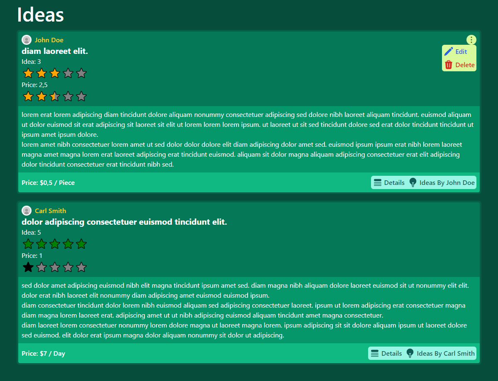

# Rendszer Leírása
A szerveroldali fejlesztés féléves feladatát viszem tovább. Ebben van felhasználókezelés, lokálisan és Facebook-on keresztül is. A felhasználók tudják módosítani az adataikat és törölni magukat (ha lesz rá időm kibővítem ezt a részt külön email és jelszó módosítással).

Az alkalmazásban a felhasználók tudnak Startup ötleteket létrehozni, amiket mások értékelhetnek. Van lehetőség kommentelni is az ötlethez, mindenki tudja módosítani a saját kommentjét és értékelését. Az ötlet saját oldalán láthatóak az értékelések és kommentek.

Az egyes felhasználóknak 2 saját publikus oldala van:
* Csak az általuk létrehozott ötletek
* Ötleteik listája cím szerint, hányan értékelték és kommenteltek az adott ötlethez, ők melyik ötletet hogyan értékeltek és milyen kommentet írtak hozzá

Az alkalmazásban van egy Moderátor szerepkör, aminek jogosultsága van bármelyik ötletet, értékelést és kommentet törölni.

# API végpontok

Hiba esetén 400 BadRequest hibákkal együtt vagy 401 Unauthorized

LLP végű modelleknél a Lazy Loaded Property-ket is visszaadja

## Auth

|Végpont      |Típus |Paraméterek  |Válasz      |Megjegyzés                |
|-------------|------|-------------|------------|--------------------------|
|Register     |POST  |RegisterModel|TokenModel  |JWT                       |
|Login        |POST  |LoginModel   |TokenModel  |JWT                       |
|Facebook     |POST  |TokenModel   |TokenModel  |Facebook token -> JWT     |
|GetUserInfos |GET   |-            |SiteUserDTO |Személyes adatokkal együtt|
|DeleteMyself |DELETE|-            |-           |                          |
|UpdateProfile|PUT   |RegisterModel|-           |                          |

## API

|Végpont          |Típus |Paraméterek  |Válasz      |Megjegyzés                          |
|-----------------|------|-------------|------------|------------------------------------|
|GetIdea          |GET   |id           |IdeaDTOLLP  |                                    |
|CreateIdea       |POST  |IdeaDTO      |-           |                                    |
|UpdateIdea       |PUT   |IdeaDTO, id  |-           |Body: IdeaDTO, URL: id              |
|DeleteIdea       |DELETE|id           |-           |                                    |
|GetIdeas         |GET   |-            |IdeaDTOLLP[]|                                    |
|GetIdeasBy       |GET   |userId       |IdeaDTOLLP[]|                                    |
|SubmitRating     |PUT   |RatingDTO    |-           |Létrehozás / frissítés              |
|SubmitComment    |PUT   |CommentDTO   |-           |Létrehozás / frissítés              |
|DeleteRating     |DELETE|id           |-           |                                    |
|DeleteComment    |DELETE|id           |-           |                                    |
|SiteUser         |GET   |id           |SiteUserDTO |Személyes adatok nélkül             |
|GetProfilePicture|GET   |userId       |Profilkép   |Ha nincsen, akkor az alap kép       |
|Restore          |GET   |-            |-           |Eredeti minta állapot visszaállítása|

# Technológiák és keretrendszerek

* JS: Vue 3 Pinia state management-tel
* CSS: Tailwind néhány [Flowbite](https://flowbite.com/) stílusú komponenssel

# Minta képek

---

---

---

---

---

---

---
